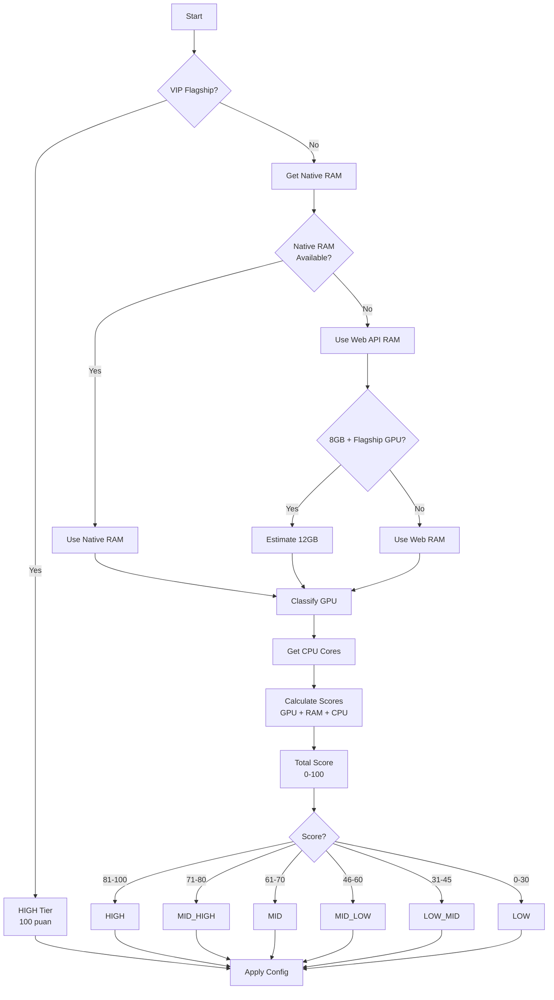

# Device Tier Sistemi - Teknik Dokümantasyon

Bu dokümantasyon, oyunun cihaz sınıflandırma sistemini, performans optimizasyonlarını ve tier-based ayarları detaylı bir şekilde açıklar.

---

## 📋 İçindekiler

1. [Tier Sistemi Genel Bakış](#tier-sistemi-genel-bakış)
2. [Tier Sınıflandırması](#tier-sınıflandırması)
3. [Skor Hesaplama Sistemi](#skor-hesaplama-sistemi)
4. [VIP Flagship Listesi](#vip-flagship-listesi)
5. [GPU Sınıflandırması](#gpu-sınıflandırması)
6. [Performans Konfigürasyonları](#performans-konfigürasyonları)
7. [Particle Optimizasyonları](#particle-optimizasyonları)
8. [Benchmark Sistemi](#benchmark-sistemi)
9. [Platform Desteği](#platform-desteği)

---

## 🎯 Tier Sistemi Genel Bakış

### 6-Tier System

Oyun, cihazları 6 farklı tier'a ayırır ve her tier için optimize edilmiş performans ayarları kullanır:

```typescript
enum DeviceTier {
  LOW = 'low',           // 0-30 puan
  LOW_MID = 'low-mid',   // 31-45 puan
  MID_LOW = 'mid-low',   // 46-60 puan
  MID = 'mid',           // 61-70 puan
  MID_HIGH = 'mid-high', // 71-80 puan
  HIGH = 'high'          // 81-100 puan
}
```

### Tier Belirleme Önceliği

```
1. VIP Flagship List (En Yüksek Öncelik)
   ↓
2. Specs-Based Scoring (GPU + RAM + CPU)
   ↓
3. Fallback (MID tier)
```

---

## 📊 Tier Sınıflandırması

### LOW Tier (0-30 puan)

**Cihaz Özellikleri**:
- RAM: < 3 GB
- CPU: 2-4 cores
- GPU: Adreno 3xx/4xx, Mali-4xx, PowerVR SGX

**Örnek Cihazlar**:
- Samsung Galaxy J Series
- Xiaomi Redmi 6/7
- Eski budget telefonlar (2018 öncesi)

**Performans Ayarları**:
```typescript
{
  fragmentPoolSize: 3,
  hardwareScaling: 1.0,
  enableGlow: false,
  enableParticles: false,
  antialias: false,
  maxTextureSize: 512
}
```

---

### LOW_MID Tier (31-45 puan)

**Cihaz Özellikleri**:
- RAM: 3-4 GB
- CPU: 4-6 cores
- GPU: Adreno 5xx (500-520), Mali-G31, PowerVR Rogue

**Örnek Cihazlar**:
- Samsung Galaxy A10/A20
- Xiaomi Redmi 8/9
- Entry-level 2019-2020 cihazlar

**Performans Ayarları**:
```typescript
{
  fragmentPoolSize: 6,
  hardwareScaling: 1.0,
  enableGlow: false,
  enableParticles: true,  // Basic particles
  antialias: false,
  maxTextureSize: 768
}
```

---

### MID_LOW Tier (46-60 puan)

**Cihaz Özellikleri**:
- RAM: 4-6 GB
- CPU: 6-8 cores
- GPU: Adreno 5xx (530-610), Mali-G51/G52

**Örnek Cihazlar**:
- Samsung Galaxy A30/A40
- Xiaomi Redmi Note 9
- Oppo A60 (60 puan)
- Honor 9X

**Performans Ayarları**:
```typescript
{
  fragmentPoolSize: 10,
  hardwareScaling: 1.0,
  enableGlow: false,
  enableParticles: true,  // More particles
  antialias: false,
  maxTextureSize: 1024
}
```

**Not**: Bu tier, 5-6 satır temizlemede lag yaşayan cihazlar için kritik optimizasyonlar içerir.

---

### MID Tier (61-70 puan)

**Cihaz Özellikleri**:
- RAM: 6-8 GB
- CPU: 8 cores
- GPU: Adreno 6xx (610-640), Mali-G57/G72

**Örnek Cihazlar**:
- Samsung Galaxy A50/A51/A55 (73 puan)
- Xiaomi Redmi Note 10/11
- Realme 7/8 Series
- OnePlus Nord N Series

**Performans Ayarları**:
```typescript
{
  fragmentPoolSize: 14,
  hardwareScaling: 1.0,
  enableGlow: false,
  enableParticles: true,
  antialias: false,
  maxTextureSize: 1280
}
```

**Not**: Bu tier, çoğu mid-range cihazı kapsar ve dengeli performans sunar.

---

### MID_HIGH Tier (71-80 puan)

**Cihaz Özellikleri**:
- RAM: 8-12 GB
- CPU: 8-10 cores
- GPU: Adreno 6xx (650-690), Mali-G68/G76

**Örnek Cihazlar**:
- Samsung Galaxy A70/A71
- Xiaomi Redmi Note 12 Pro
- Realme GT Neo Series
- OnePlus Nord 2/3

**Performans Ayarları**:
```typescript
{
  fragmentPoolSize: 18,
  hardwareScaling: 1.0,
  enableGlow: false,
  enableParticles: true,
  antialias: true,  // Antialias enabled
  maxTextureSize: 1536
}
```

---

### HIGH Tier (81-100 puan)

**Cihaz Özellikleri**:
- RAM: 12+ GB
- CPU: 10+ cores
- GPU: Adreno 7xx/8xx, Mali-G78+, Immortalis, Apple GPU

**Örnek Cihazlar**:
- Samsung Galaxy S23/S24/S25 Series
- Xiaomi 14/15 Series
- OnePlus 12/13
- Google Pixel 8/9
- iPhone 15/16/17
- ASUS ROG Phone 8/9

**Performans Ayarları**:
```typescript
{
  fragmentPoolSize: 22,
  hardwareScaling: 1.0,
  enableGlow: true,   // All effects enabled
  enableParticles: true,
  antialias: true,
  maxTextureSize: 2048
}
```

---

## 🧮 Skor Hesaplama Sistemi

### Scoring Formula (0-100 puan)

```typescript
Total Score = GPU Score (0-50) + RAM Score (0-30) + CPU Score (0-20)
```

### GPU Score (0-50 puan) - 50% Ağırlık

GPU tier'ı 0-5 arası sınıflandırılır, sonra 0-50 skalasına çevrilir:

```typescript
GPU Tier × 10 = GPU Score

Tier 5 (HIGH) → 50 puan
Tier 4 (MID-HIGH) → 40 puan
Tier 3 (MID) → 30 puan
Tier 2 (LOW-MID) → 20 puan
Tier 1 (LOW) → 10 puan
Tier 0 (Unknown) → 0 puan
```

### RAM Score (0-30 puan) - 30% Ağırlık

```typescript
16+ GB → 30 puan (Extreme flagship)
12+ GB → 25 puan (Flagship)
8+ GB  → 20 puan (Premium)
6+ GB  → 15 puan (Mid)
4+ GB  → 10 puan (Low)
3+ GB  → 5 puan (Very low)
< 3 GB → 0 puan (Extremely low)
```

**Smart RAM Estimation**:
- Web API 8GB rapor ederse + GPU flagship ise → 12GB estimate edilir
- Native Android bridge kullanılırsa gerçek RAM değeri alınır

### CPU Score (0-20 puan) - 20% Ağırlık

```typescript
10+ cores → 20 puan (Flagship: Snapdragon 8 Gen 3/Elite)
8+ cores  → 15 puan (Modern)
6+ cores  → 10 puan (Mid)
4+ cores  → 5 puan (Old)
< 4 cores → 0 puan (Very old)
```

### Örnek Hesaplamalar

**Samsung Galaxy A55**:
```
GPU: Adreno 644 (Tier 3) → 30 puan
RAM: 8 GB → 20 puan
CPU: 8 cores → 15 puan
─────────────────────────
Total: 65 puan → MID tier
```

**Xiaomi 14 Pro**:
```
GPU: Adreno 750 (Tier 5) → 50 puan
RAM: 12 GB → 25 puan
CPU: 10 cores → 20 puan
─────────────────────────
Total: 95 puan → HIGH tier
```

**Oppo A60**:
```
GPU: Mali-G52 (Tier 2) → 20 puan
RAM: 6 GB → 15 puan
CPU: 8 cores → 15 puan
─────────────────────────
Total: 50 puan → MID_LOW tier
```

---

## 🌟 VIP Flagship Listesi

VIP cihazlar, spec'lere bakmaksızın otomatik olarak **HIGH tier** (100 puan) alır.

### Samsung Galaxy S Series (2023-2025)

```
SM-S911, SM-S916, SM-S918  // S23, S23+, S23 Ultra
SM-S921, SM-S926, SM-S928  // S24, S24+, S24 Ultra
SM-S931, SM-S936, SM-S938  // S25, S25+, S25 Ultra
```

### Samsung Galaxy Z Fold/Flip (2023-2025)

```
SM-F946, SM-F731  // Z Fold 5, Z Flip 5
SM-F956, SM-F741  // Z Fold 6, Z Flip 6
```

### Samsung Galaxy Tab S9/S10 Series

```
SM-X910, SM-X916  // Tab S9, S9+
SM-X110, SM-X116  // Tab S10, S10+
```

### Xiaomi Flagship (2023-2025)

```
23127PN0C, 2312DRA50C  // Xiaomi 14, 14 Pro
24031PN0DC, 2405CPX3DG // Xiaomi 14 Ultra, 15
2407FPN8EG             // Xiaomi 15 Pro
```

### POCO Flagship

```
23124PC75G, 23113RKC6G // POCO F6, F6 Pro
24069PC21G             // POCO X7 Pro
```

### OnePlus Flagship (2023-2025)

```
CPH2581, CPH2609  // OnePlus 12, 12R
CPH2617, CPH2619  // OnePlus 13, 13 Pro
```

### Google Pixel (2023-2025)

```
Pixel 8, Pixel 8 Pro, Pixel 8a
Pixel 9, Pixel 9 Pro, Pixel 9 Pro XL
```

### iPhone (2023-2025)

```
iPhone15, iPhone16, iPhone17  // All variants
```

### Oppo Find X Series

```
CPH2525, CPH2581  // Find X7, X7 Pro
CPH2609           // Find X8
```

### Vivo X Series

```
V2309A, V2324A  // X100, X100 Pro
V2352A          // X200
```

### Realme GT Series

```
RMX3700, RMX3708  // GT 5, GT 5 Pro
RMX3800           // GT 6
```

### ASUS ROG Phone

```
ASUS_AI2401, ASUS_AI2501  // ROG Phone 8, 9
```

### Nothing Phone

```
A065, A142  // Nothing Phone (2), (2a)
```

---

## 🎮 GPU Sınıflandırması

### HIGH-END GPUs (Tier 5 - 50 puan)

**Adreno 8xx Series** (Snapdragon 8 Gen 4/Elite - 2024+):
```
Adreno 8xx (any variant)
Adreno (TM) 8
```

**Adreno 7xx Series** (Snapdragon 8 Gen 1/2/3):
```
Adreno 730, 740, 750
Adreno (TM) 7
```

**Mali Flagship**:
```
Mali-G78, Mali-G710, Mali-G715, Mali-G720
Immortalis (ARM flagship)
```

**Apple GPU**:
```
Apple GPU (A14+, M1+, M2+)
```

**Desktop GPUs**:
```
NVIDIA GeForce
AMD Radeon
```

---

### MID-HIGH GPUs (Tier 4 - 40 puan)

**Adreno 6xx Upper** (650-690):
```
Adreno 650, 660, 680, 690
Adreno (TM) 65-69
```

**Mali Upper Mid**:
```
Mali-G68, Mali-G76
```

---

### MID GPUs (Tier 3 - 30 puan)

**Adreno 6xx Lower** (610-640):
```
Adreno 610, 620, 630, 640, 644
Adreno (TM) 60-64
```

**Mali Mid**:
```
Mali-G57, Mali-G72
```

**Intel Iris**:
```
Intel Iris (integrated)
```

---

### LOW-MID GPUs (Tier 2 - 20 puan)

**Adreno 5xx Upper** (530-610):
```
Adreno 530, 540, 550, 560, 610
Adreno (TM) 53-59
```

**Mali Entry Mid**:
```
Mali-G52, Mali-G51, Mali-G71
```

**PowerVR Rogue**:
```
PowerVR Rogue (entry-level)
```

---

### LOW GPUs (Tier 1 - 10 puan)

**Adreno 5xx Lower** (500-520):
```
Adreno 500, 505, 506, 508, 509, 510, 512, 520
Adreno (TM) 50-52
```

**Adreno 4xx/3xx**:
```
Adreno 4xx (all variants)
Adreno 3xx (all variants)
```

**Mali Old**:
```
Mali-4xx (all variants)
Mali-G31
```

**PowerVR SGX**:
```
PowerVR SGX (old)
```

**VideoCore**:
```
VideoCore (Raspberry Pi)
```

**Intel HD Old**:
```
Intel HD 2000-5000 series
```

---

## ⚙️ Performans Konfigürasyonları

### Fragment Pool Size

Particle pool boyutu - daha fazla particle için daha büyük pool:

```typescript
LOW:      3 fragments
LOW_MID:  6 fragments
MID_LOW:  10 fragments
MID:      14 fragments
MID_HIGH: 18 fragments
HIGH:     22 fragments
```

### Hardware Scaling

**TÜM TIER'LAR**: `1.0` (Full resolution)

Önceden düşük tier'larda 0.75 kullanılıyordu, ancak kullanıcı geri bildirimi sonrası tüm tier'lar full resolution kullanıyor.

### Enable Glow

Glow efektleri (sadece HIGH tier):

```typescript
LOW - MID_HIGH: false
HIGH:           true
```

### Enable Particles

Particle efektleri:

```typescript
LOW:      false (No particles)
LOW_MID+: true  (Particles enabled)
```

### Antialias

Anti-aliasing (kenar yumuşatma):

```typescript
LOW - MID:      false
MID_HIGH+:      true
```

### Max Texture Size

Maksimum texture boyutu:

```typescript
LOW:      512px
LOW_MID:  768px
MID_LOW:  1024px
MID:      1280px
MID_HIGH: 1536px
HIGH:     2048px
```

---

## 🎆 Particle Optimizasyonları

### Line Clear Particle Reduction

Büyük satır temizlemelerinde (5-6 satır) particle sayısı tier'a göre azaltılır:

#### 5+ Satır Temizleme

```typescript
LOW / LOW_MID:  80% reduction (0.2x multiplier)
MID_LOW / MID:  60% reduction (0.4x multiplier)
MID_HIGH:       40% reduction (0.6x multiplier)
HIGH:           20% reduction (0.8x multiplier)
```

**Örnek (6 satır temizleme)**:
```
Original: 48 particles
LOW:      48 × 0.2 = 9.6 ≈ 10 particles
MID_LOW:  48 × 0.4 = 19.2 ≈ 19 particles
MID:      48 × 0.4 = 19.2 ≈ 19 particles
HIGH:     48 × 0.8 = 38.4 ≈ 38 particles
```

#### 3-4 Satır Temizleme

```typescript
LOW / LOW_MID:  60% reduction (0.4x multiplier)
MID_LOW / MID:  40% reduction (0.6x multiplier)
MID_HIGH:       20% reduction (0.8x multiplier)
HIGH:           No reduction (1.0x multiplier)
```

**Örnek (4 satır temizleme)**:
```
Original: 32 particles
LOW:      32 × 0.4 = 12.8 ≈ 13 particles
MID_LOW:  32 × 0.6 = 19.2 ≈ 19 particles
MID:      32 × 0.6 = 19.2 ≈ 19 particles
HIGH:     32 × 1.0 = 32 particles (no reduction)
```

### Perfect Clear Confetti

Perfect clear'da tier'a göre confetti sayısı:

```typescript
Reduced Motion: 10 particles

LOW / LOW_MID:  15 particles
MID_LOW / MID:  25 particles
MID_HIGH:       35 particles
HIGH:           50 particles
```

### Explosion Particles

Combo >= 10'da explosion efektleri tamamen devre dışı (performans):

```typescript
Combo < 5:   Max 3 explosions
Combo 5-9:   Max 2 explosions
Combo >= 10: 0 explosions (disabled)
```

---

## 🔬 Benchmark Sistemi

### Micro-Benchmark Tests

Splash screen sırasında ~500ms süren testler:

#### 1. GPU Test (200ms)

**Test**: WebGL ile 500 triangle/frame × 120 frame render

**Scoring**:
```
240 FPS = 100 puan (very high)
120 FPS = 50 puan
60 FPS  = 25 puan
```

**Hesaplama**:
```typescript
score = min(100, (fps / 240) × 100)
```

#### 2. CPU Test (150ms)

**Test**: 100×100 matrix multiplication + math operations

**Scoring**:
```
100ms = 100 puan (flagship)
300ms = 50 puan (mid-range)
500ms = 20 puan (low-end)
```

**Hesaplama**:
```typescript
score = min(100, max(0, 150 - (elapsed / 4)))
```

#### 3. Memory Test (150ms)

**Test**: 5M element array operations (min/max, sum, sort)

**Scoring**:
```
200ms  = 100 puan (flagship)
500ms  = 50 puan (mid-range)
1000ms = 10 puan (low-end)
```

**Hesaplama**:
```typescript
score = min(100, max(0, 125 - (elapsed / 8)))
```

### Composite Score

```typescript
compositeScore = (gpuScore × 0.5) + 
                 (cpuScore × 0.3) + 
                 (memoryScore × 0.2)
```

**Ağırlıklar**:
- GPU: 50% (en önemli)
- CPU: 30%
- Memory: 20%

### Benchmark Sonuçları

Sonuçlar localStorage'a kaydedilir ve Settings'de gösterilir:

```typescript
{
  gpuScore: 85,
  cpuScore: 72,
  memoryScore: 68,
  compositeScore: 78,
  duration: 487,
  timestamp: 1704067200000
}
```

---

## 📱 Platform Desteği

### Native Platform (Android/iOS)

**RAM Detection**:
1. **Android Native Bridge** (En doğru):
   ```typescript
   window.FluxGridNative.getTotalRAM()
   ```
   - Gerçek total RAM değeri
   - Android'de Java/Kotlin bridge ile alınır

2. **Capacitor Device API**:
   ```typescript
   Device.getInfo()
   ```
   - Device model bilgisi
   - Platform bilgisi

3. **Fallback**: Web API

**Device Model**:
```typescript
const deviceInfo = await Device.getInfo();
const model = deviceInfo.model; // "SM-S918B"
```

### Web Platform

**RAM Detection**:
```typescript
navigator.deviceMemory
```
- **Limitation**: 8GB cap
- **Solution**: Smart RAM estimation (GPU flagship ise 12GB estimate)

**GPU Detection**:
```typescript
const gl = canvas.getContext('webgl');
const debugInfo = gl.getExtension('WEBGL_debug_renderer_info');
const renderer = gl.getParameter(debugInfo.UNMASKED_RENDERER_WEBGL);
```

**Screen Refresh Rate**:
```typescript
window.screen.refreshRate || 60
```
- Default: 60Hz
- Not widely supported yet

---

## 🎯 Tier Belirleme Akışı



---

## 📊 Tier Distribution (Tahmini)

Piyasadaki cihaz dağılımı (2024):

```
LOW:      5%  (Çok eski cihazlar)
LOW_MID:  10% (Entry-level 2019-2020)
MID_LOW:  20% (Budget 2021-2023)
MID:      35% (Mid-range 2022-2024)
MID_HIGH: 15% (Upper mid-range)
HIGH:     15% (Flagship 2023-2025)
```

---

## 🔧 Kullanım Örnekleri

### 1. Device Capability Detection

```typescript
import { detectDeviceCapabilities } from '@/utils/platform/deviceCapability';

const capabilities = await detectDeviceCapabilities();

console.log('Device Tier:', capabilities.tier);
console.log('Score:', capabilities.score);
console.log('RAM:', capabilities.memory, 'GB');
console.log('GPU:', capabilities.gpuRenderer);
console.log('Is VIP:', capabilities.isVIP);
```

### 2. Performance Config

```typescript
import { getPerformanceConfig } from '@/utils/platform/deviceCapability';

const config = getPerformanceConfig(capabilities.tier);

console.log('Fragment Pool:', config.fragmentPoolSize);
console.log('Particles:', config.enableParticles);
console.log('Glow:', config.enableGlow);
```

### 3. Particle System Integration

```typescript
// LineClearAnimationSystem.ts
lineClearSystem.setDeviceTier(capabilities.tier);

// Automatic particle reduction based on tier
lineClearSystem.triggerLineClear({
  clearedLines: [0, 1, 2, 3, 4, 5], // 6 lines
  // ...
});
// LOW tier: ~10 particles
// MID tier: ~19 particles
// HIGH tier: ~38 particles
```

### 4. Benchmark

```typescript
import { runMicroBenchmark } from '@/utils/platform/benchmark';

const result = await runMicroBenchmark();

console.log('GPU Score:', result.gpuScore);
console.log('CPU Score:', result.cpuScore);
console.log('Memory Score:', result.memoryScore);
console.log('Composite:', result.compositeScore);
```

---

## 🐛 Troubleshooting

### Problem: Cihaz yanlış tier'a atanıyor

**Çözüm 1**: VIP listesine ekle
```typescript
// deviceCapability.ts
const VIP_FLAGSHIP_MODELS = [
  'YOUR_DEVICE_MODEL', // Add here
  // ...
];
```

**Çözüm 2**: GPU classification'ı kontrol et
```typescript
// Check GPU renderer
const gpu = getGPURenderer();
console.log('GPU:', gpu);
```

### Problem: RAM yanlış algılanıyor

**Çözüm**: Native bridge kullan (Android)
```kotlin
// MainActivity.kt
@JavascriptInterface
fun getTotalRAM(): Double {
    val memInfo = ActivityManager.MemoryInfo()
    activityManager.getMemoryInfo(memInfo)
    return memInfo.totalMem / (1024.0 * 1024.0 * 1024.0) // GB
}
```

### Problem: Particle lag (5-6 satır temizleme)

**Çözüm**: Tier-based reduction zaten aktif
```typescript
// Check if device tier is correct
console.log('Device Tier:', capabilities.tier);

// If tier is correct but still lagging, reduce multiplier further
// LineClearAnimationSystem.ts - line 88-105
```

---

## 📈 Performance Metrics

### Target FPS

```
LOW:      30 FPS (stable)
LOW_MID:  45 FPS
MID_LOW:  50 FPS
MID:      55 FPS
MID_HIGH: 60 FPS
HIGH:     60 FPS (with all effects)
```

### Memory Usage

```
LOW:      < 200 MB
LOW_MID:  < 300 MB
MID_LOW:  < 400 MB
MID:      < 500 MB
MID_HIGH: < 600 MB
HIGH:     < 800 MB
```

### Particle Count (6 satır temizleme)

```
LOW:      ~10 particles
LOW_MID:  ~10 particles
MID_LOW:  ~19 particles
MID:      ~19 particles
MID_HIGH: ~29 particles
HIGH:     ~38 particles
```

---

## 🔄 Version History

### v1.0 (Current)
- 6-tier system implemented
- VIP flagship list (50+ models)
- Specs-based scoring (GPU 50%, RAM 30%, CPU 20%)
- Tier-based particle reduction
- Native RAM detection (Android)
- Smart RAM estimation
- Full resolution for all tiers (hardwareScaling: 1.0)

### v0.9 (Previous)
- 3-tier system (LOW, MID, HIGH)
- Benchmark-based classification
- Hardware scaling for LOW tier (0.75)

---

## 📝 Notes

- **Benchmark sistemi kaldırıldı**: Sadece specs-based scoring kullanılıyor
- **Tüm tier'lar full resolution**: hardwareScaling = 1.0 (kullanıcı geri bildirimi)
- **VIP listesi öncelikli**: Flagship cihazlar otomatik HIGH tier
- **Particle optimization kritik**: MID/MID_LOW tier'lar için 5-6 satır temizleme optimizasyonu
- **Native RAM detection**: Android'de Java/Kotlin bridge ile gerçek RAM değeri
- **Smart RAM estimation**: Web API 8GB cap'i için flagship GPU kontrolü

---

**Son Güncelleme**: 2024
**Versiyon**: 1.0
**Tier Sayısı**: 6 (LOW, LOW_MID, MID_LOW, MID, MID_HIGH, HIGH)
**VIP Cihaz Sayısı**: 50+ flagship model
**Scoring System**: GPU (50%) + RAM (30%) + CPU (20%)
